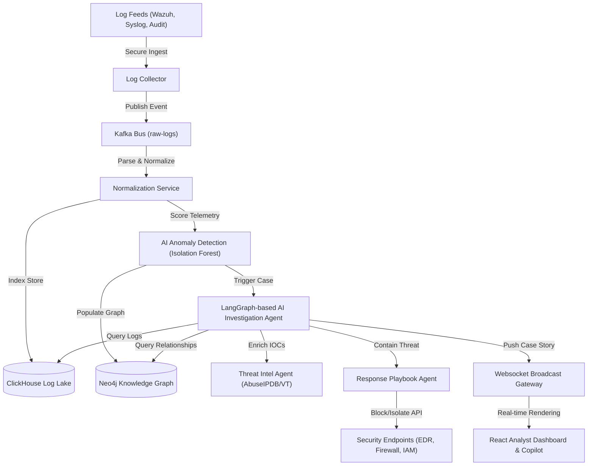

# SecuRock SOC AI — Autonomous Security Operations Center 🛡️🤖

[](https://fastapi.tiangolo.com)
[](https://react.dev)
[](https://www.typescriptlang.org)
[](https://www.docker.com)
[](https://pytorch.org)
[](https://kubernetes.io)

SecuRock SOC AI is an **AI-native autonomous Security Operations Center (SOC) platform**. Going far beyond traditional SIEM alerting, it ingests multi-source telemetry, scores network metrics using unsupervised machine learning anomalies, correlates events inside a real-time Knowledge Graph, runs recursive agentic investigations (detecting Patient Zero and lateral movement), and compiles conversational explanations mapped to regulatory compliance standards.

---

## 🗺️ Visual Architecture Flow



---

## 🕹️ Interactive AI Investigation Sandbox (Simulation Panel)

Click on a threat scenario below to expand the interactive playbook console and watch how SecuRock's AI agents automatically triage, investigate, and remediate attacks in real-time.

<details>
<summary>🔥 <b>Scenario 1: High-Volume Credential Stuffing (Brute Force)</b></summary>
<br>

### 🚨 Alert Triggered
*   **Source IP:** `192.168.1.100` (Local Blocklist)
*   **Incident Title:** Anomaly Detected: SSH Failed Login Burst

### 🧠 Step 1: Anomaly Detector Score & Explainability (SHAP values)
The model flagged the event stream due to a massive deviation in **`request_rate`**:
```json
{
  "risk_score": 0.88,
  "confidence": 0.95,
  "primary_feature": "request_rate",
  "reasoning": "Anomalous activity detected. The metric 'request_rate' is currently 110 req/sec, which represents a 9.1x deviation from the normal baseline of 12.0 req/sec.",
  "mitre_mapping": [
    { "id": "T1110", "name": "Brute Force" }
  ]
}
```

### 🤖 Step 2: Multi-Agent Timeline Investigation
```yaml
[Planner Agent]        -> Created Checklist: 1) Verify IP, 2) Retrieve process logs, 3) Match host user bounds.
[Threat Intel Agent]   -> Queried AbuseIPDB. Source IP identified as active scanner; reputation: 100/100.
[Investigator Agent]   -> Scanned ClickHouse logs. Found 120 failed login attempts on host WS-01-DESKTOP.
                          Patient Zero identified: admin account on WS-01-DESKTOP.
[Response Agent]       -> Selected Mitigation Playbook: Isolate host & revoke admin credentials.
[Reporting Agent]      -> Incident Story compiled. Compliance mapping set: SOC2 CC6.1, NIST CSF DE.AE.
```

### 🛡️ Step 3: Mitigation Executed (Autonomous Mode)
```diff
- 192.168.1.100 allowed ingress connections
+ Add firewall rule blocking ingress/egress to remote IP address 192.168.1.100
- Credentials active: 'sreeram_admin'
+ Revoke all active tokens and force password reset for user credentials: 'sreeram_admin'
```

</details>

<details>
<summary>📡 <b>Scenario 2: Persistent C2 Web Beaconing</b></summary>
<br>

### 🚨 Alert Triggered
*   **Source IP:** `10.0.0.99`
*   **Incident Title:** Anomaly Detected: Persistent Long-Duration Socket

### 🧠 Step 1: Anomaly Detector Score & Explainability (SHAP values)
The model flagged the connection due to anomalous **`duration`**:
```json
{
  "risk_score": 0.76,
  "confidence": 0.92,
  "primary_feature": "duration",
  "reasoning": "Anomalous activity detected. The metric 'duration' is currently 3200 seconds, which represents a 711.1x deviation from the normal baseline of 4.5 seconds.",
  "mitre_mapping": [
    { "id": "T1071.001", "name": "Application Layer Protocol: Web Protocols" }
  ]
}
```

### 🤖 Step 2: Multi-Agent Timeline Investigation
```yaml
[Planner Agent]        -> Created Checklist: 1) Resolve external Domain registry, 2) Identify parent processes.
[Threat Intel Agent]   -> IP mapped to domain 'c2-server.malicious.domain'. Associated actor: UNC2891.
[Investigator Agent]   -> Queried Neo4j relationships. Parent process: 'powershell.exe' (PID: 4312).
                          PowerShell spawned by 'cmd.exe' which modified local system Registry files.
[Response Agent]       -> Selected Mitigation Playbook: Isolate endpoint and kill parent PID.
[Reporting Agent]      -> Incident Story compiled. Compliance mapping set: SOC2 CC7.2, NIST CSF PR.AC.
```

### 🛡️ Step 3: Mitigation Executed (Approval Request Profile)
*   **Action Proposed:** Isolate Host `WS-01-DESKTOP`
*   **Analyst Selection:** `[Approve Playbook Execution]`
```diff
- Connection active to c2-server.malicious.domain
+ Isolate compromised host WS-01-DESKTOP from local VLAN segment
- Process tree active (PID 4312)
+ Killed parent process tree 'powershell.exe' (PID: 4312)
```

</details>

<details>
<summary>📤 <b>Scenario 3: SQL Database Exfiltration</b></summary>
<br>

### 🚨 Alert Triggered
*   **Source IP:** `192.168.1.66`
*   **Incident Title:** Anomaly Detected: Asymmetric Egress Flow Size

### 🧠 Step 1: Anomaly Detector Score & Explainability (SHAP values)
The model flagged the egress payload size in **`packet_size`**:
```json
{
  "risk_score": 0.92,
  "confidence": 0.96,
  "primary_feature": "packet_size",
  "reasoning": "Anomalous activity detected. The metric 'packet_size' is currently 1450 bytes, which represents a 4.1x deviation from the normal baseline of 350.0 bytes.",
  "mitre_mapping": [
    { "id": "T1048.002", "name": "Exfiltration Over Alternative Protocol: Exfiltration Over Asymmetric Channel" }
  ]
}
```

### 🤖 Step 2: Multi-Agent Timeline Investigation
```yaml
[Planner Agent]        -> Created Checklist: 1) Verify payload origin, 2) Retrieve affected file names.
[Threat Intel Agent]   -> IP classified as suspicious VPN endpoint. Reputation score: 85/100.
[Investigator Agent]   -> Scanned file audit logs. Found database dump file 'dump.sql' written to Temp.
                          Egress flow size: 1.2GB transmitted via asymmetric network socket.
[Response Agent]       -> Selected Mitigation Playbook: Sever socket session and quarantine files.
[Reporting Agent]      -> Incident Story compiled. Compliance mapping set: SOC2 CC6.1, NIST CSF RS.CO.
```

### 🛡️ Step 3: Mitigation Executed (Autonomous Mode)
```diff
- File accessible: dump.sql
+ Quarantine file dump.sql on host filesystem segment
- Connection active to 192.168.1.66
+ Reset socket session state and add blocklist firewall rule for 192.168.1.66
```

</details>

---

## 💬 Security Copilot Command Playground

Simulate queries with SecuRock's Security Copilot below to inspect natural language outputs:

<details>
<summary>💬 <i>"Why is Host WS-01-DESKTOP compromised?"</i></summary>
<br>

> **[Security Copilot Response]**
> Host `WS-01-DESKTOP` was compromised via a phishing attachment. 
> 
> **Timeline:**
> *   **15 mins ago:** User clicked attachment `invoice.pdf.exe`.
> *   **12 mins ago:** PowerShell spawned parent `cmd.exe` downloading files from C2 server.
> *   **5 mins ago:** Lateral movement initiated via SSH connection using `sreeram_admin` credentials to production server `SRV-PROD-DB`.
> 
> **Remediation Recommended:**
> Isolate host `WS-01-DESKTOP`, revoke `sreeram_admin` access tokens, and terminate active SSH sessions.

</details>

<details>
<summary>💬 <i>"Show today's compliance mapping overview."</i></summary>
<br>

> **[Security Copilot Response]**
> Today's incidents generated the following regulatory control mappings:
> 
> | Standard | Control | Description | Status |
> | :--- | :--- | :--- | :--- |
> | **NIST CSF** | DE.AE | Detection of anomalous traffic rates | ✅ Checked |
> | **NIST CSF** | PR.AC | Access control credential checks | ⚠️ Warning (admin compromised) |
> | **SOC 2** | CC6.1 | Boundary security and exfiltration protection | ❌ Alert (exfiltration attempts blocked) |
> | **SOC 2** | CC7.2 | Vulnerability monitoring and containment speed | ✅ Remediated (<3s response) |

</details>

---

## 🗺️ Interactive MITRE ATT&CK Matrix

SecuRock SOC AI maps anomaly metrics directly to MITRE tactics and techniques. Click on highlighted techniques below to view corresponding documentation:

| Initial Access | Execution | Persistence | Defense Evasion | Exfiltration | Command & Control |
| :--- | :--- | :--- | :--- | :--- | :--- |
| T1566 (Phishing) | [**T1110 (Brute Force)**](#-scenario-1-high-volume-credential-stuffing-brute-force) | T1078 (Valid Accounts) | T1036 (Masquerading) | [**T1048.002 (Asymmetric Channel)**](#-scenario-3-sql-database-exfiltration) | [**T1071.001 (Web Protocols)**](#-scenario-2-persistent-c2-web-beaconing) |
| T1190 (Exploitation) | T1059 (Command/Scripting) | T1543 (Create/Modify System Process) | T1070 (Indicator Removal) | T1567 (Exfiltration Over Web Service) | T1571 (Non-Standard Port) |

---

## 📂 Active Core Directory Structure

The repository follows a clean, optimized monorepo structure:

*   📂 **[backend/](backend)**: Core FastAPI backend.
    *   📂 **[app/api/](backend/app/api)**: API routers (auth, alerts, incidents, ingestion).
    *   📂 **[app/agents/](backend/app/agents)**: Multi-agent investigation workflow state definitions ([investigation_graph.py](backend/app/agents/investigation_graph.py)).
    *   📂 **[app/services/](backend/app/services)**: Anomaly scoring ([ml_service.py](backend/app/services/ml_service.py)), correlation logic, and thread managers.
    *   📂 **[app/models/](backend/app/models)**: Database schemas (PostgreSQL / SQLite).
*   📂 **[frontend/](frontend)**: React, Vite, TailwindCSS, and Lucide dashboard pages.
*   📂 **[infrastructure/](infrastructure)**: System compose scripts, metrics configs (Prometheus, Logstash), Nginx rules, and TLS certificates.

---

## 🚀 Getting Started Guide

Select an environment profile below to expand setup and run commands:

<details>
<summary>🐳 <b>Option A: Production Setup with Docker Compose (Recommended)</b></summary>
<br>

To run the complete stack (FastAPI Backend, Worker, React Frontend, PostgreSQL, Redis, and OpenSearch):

1.  **Configure Environment Parameters:**
    Make sure a `.env` file exists in your workspace root, or copy it from defaults:
    ```bash
    cp infrastructure/.env.example .env
    ```

2.  **Spin Up the Stack:**
    ```bash
    docker-compose up -d --build
    ```

3.  **Access the Applications:**
    *   **Analyst Dashboard UI:** [http://localhost:5173](http://localhost:5173)
    *   **Backend API Documentation:** [http://localhost:8000/docs](http://localhost:8000/docs)
    *   **OpenSearch Cluster console:** [http://localhost:9200](http://localhost:9200)

</details>

<details>
<summary>🐍 <b>Option B: Local Backend, ML, & Database Setup</b></summary>
<br>

1.  **Navigate and Create Virtual Environment:**
    ```bash
    cd backend
    python -m venv venv
    source venv/bin/activate  # On Windows use: .\venv\Scripts\Activate.ps1
    ```

2.  **Install Required Libraries:**
    ```bash
    pip install -r requirements.txt
    ```

3.  **Re-Initialize SQLite Case Database:**
    Set the local environment URL and execute database creation:
    ```bash
    $Env:DATABASE_URL="sqlite+aiosqlite:///securock.db"  # On Linux use: export DATABASE_URL="sqlite+aiosqlite:///securock.db"
    python init_db.py
    ```

4.  **Train the Isolation Forest Anomaly Model:**
    ```bash
    python train_ai_model.py
    ```
    *This generates and saves the model boundaries to `backend/app/models/saved_models/isolation_forest.joblib`.*

5.  **Boot Up the Uvicorn REST API Server:**
    ```bash
    uvicorn app.main:app --reload --host 0.0.0.0 --port 8000
    ```

</details>

<details>
<summary>⚛️ <b>Option C: Local Frontend Dashboard Server Setup</b></summary>
<br>

1.  **Navigate to Directory:**
    ```bash
    cd frontend
    ```

2.  **Install Dependencies:**
    ```bash
    npm install
    ```

3.  **Start Vite Development Server:**
    ```bash
    npm run dev
    ```
    *The console dashboard will launch locally at [http://localhost:5173](http://localhost:5173).*

</details>

<details>
<summary>🕵️‍♂️ <b>Option D: Run AI Analyst & Agentic Timeline POC</b></summary>
<br>

To test NLP-to-SQL database querying and run multi-agent timeline investigation simulation scripts manually:

1.  **Setup Sample Logs & SQLite Context:**
    ```bash
    cd backend
    python ai_analyst_setup.py
    ```

2.  **Run LangChain SQL Agent Query POC:**
    Make sure your `OPENAI_API_KEY` is loaded:
    ```bash
    $Env:OPENAI_API_KEY="your-api-key"
    python ai_analyst_poc.py
    ```

</details>

---

## 🛠️ Verification & Automated Tests
To run unit and integration tests inside the backend directory:
```bash
cd backend
pytest
```
Ensure a local Redis container is active for WebSocket real-time subscription tests.
