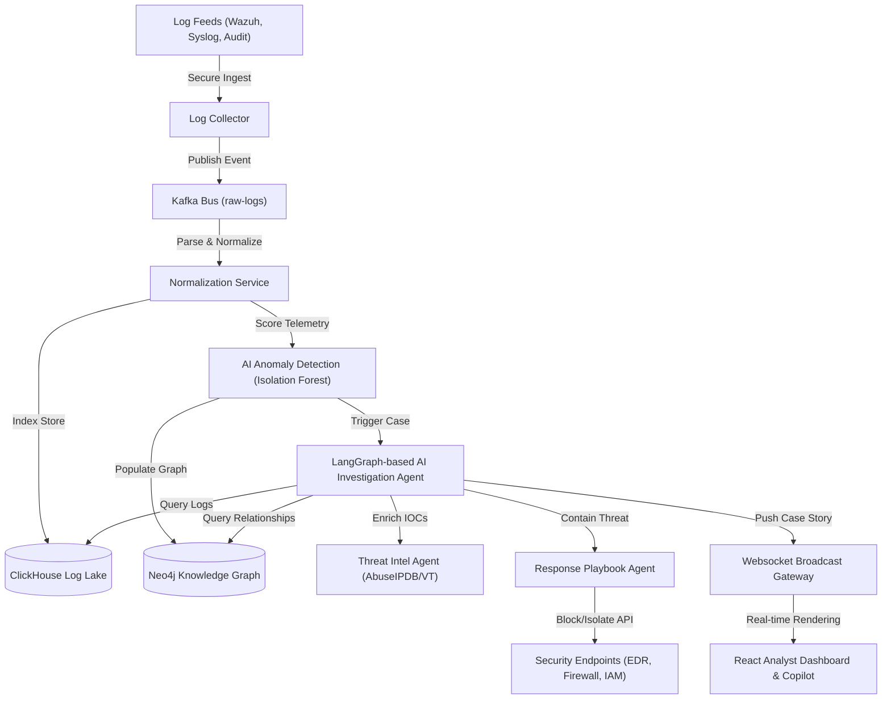

# SecuRock SOC AI — Autonomous Security Operations Center 🛡️🤖

[](https://fastapi.tiangolo.com)
[](https://react.dev)
[](https://www.typescriptlang.org)
[](https://www.docker.com)
[](https://pytorch.org)
[](https://kubernetes.io)

SecuRock SOC AI is an **AI-native autonomous Security Operations Center (SOC) platform**. Going far beyond traditional SIEM alerting, it ingests multi-source telemetry, scores network metrics using unsupervised machine learning anomalies, correlates events inside a real-time Knowledge Graph, runs recursive agentic investigations (detecting Patient Zero and lateral movement), and compiles conversational explanations mapped to regulatory compliance standards.

---

## 🗺️ Visual Architecture Flow



---

## 📂 Active Core Directory Structure

The repository follows a clean, optimized monorepo structure:

*   📂 **[backend/](backend)**: Core FastAPI backend.
    *   📂 **[app/api/](backend/app/api)**: API routers (auth, alerts, incidents, ingestion).
    *   📂 **[app/agents/](backend/app/agents)**: Multi-agent investigation workflow state definitions ([investigation_graph.py](backend/app/agents/investigation_graph.py)).
    *   📂 **[app/services/](backend/app/services)**: Anomaly scoring ([ml_service.py](backend/app/services/ml_service.py)), correlation logic, and thread managers.
    *   📂 **[app/models/](backend/app/models)**: Database schemas (PostgreSQL / SQLite).
*   📂 **[frontend/](frontend)**: React, Vite, TailwindCSS, and Lucide dashboard pages.
*   📂 **[infrastructure/](infrastructure)**: System compose scripts, metrics configs (Prometheus, Logstash), Nginx rules, and TLS certificates.

---

## 🚀 Interactive Getting Started Guide

Select an environment profile below to expand setup and run commands:

<details>
<summary>🐳 <b>Option A: Production Setup with Docker Compose (Recommended)</b></summary>
<br>

To run the complete stack (FastAPI Backend, Worker, React Frontend, PostgreSQL, Redis, and OpenSearch):

1.  **Configure Environment Parameters:**
    Make sure a `.env` file exists in your workspace root, or copy it from defaults:
    ```bash
    cp infrastructure/.env.example .env
    ```

2.  **Spin Up the Stack:**
    ```bash
    docker-compose up -d --build
    ```

3.  **Access the Applications:**
    *   **Analyst Dashboard UI:** [http://localhost:5173](http://localhost:5173)
    *   **Backend API Documentation:** [http://localhost:8000/docs](http://localhost:8000/docs)
    *   **OpenSearch Cluster console:** [http://localhost:9200](http://localhost:9200)

</details>

<details>
<summary>🐍 <b>Option B: Local Backend, ML, & Database Setup</b></summary>
<br>

1.  **Navigate and Create Virtual Environment:**
    ```bash
    cd backend
    python -m venv venv
    source venv/bin/activate  # On Windows use: .\venv\Scripts\Activate.ps1
    ```

2.  **Install Required Libraries:**
    ```bash
    pip install -r requirements.txt
    ```

3.  **Re-Initialize SQLite Case Database:**
    Set the local environment URL and execute database creation:
    ```bash
    $Env:DATABASE_URL="sqlite+aiosqlite:///securock.db"  # On Linux use: export DATABASE_URL="sqlite+aiosqlite:///securock.db"
    python init_db.py
    ```

4.  **Train the Isolation Forest Anomaly Model:**
    ```bash
    python train_ai_model.py
    ```
    *This generates and saves the model boundaries to `backend/app/models/saved_models/isolation_forest.joblib`.*

5.  **Boot Up the Uvicorn REST API Server:**
    ```bash
    uvicorn app.main:app --reload --host 0.0.0.0 --port 8000
    ```

</details>

<details>
<summary>⚛️ <b>Option C: Local Frontend Dashboard Server Setup</b></summary>
<br>

1.  **Navigate to Directory:**
    ```bash
    cd frontend
    ```

2.  **Install Dependencies:**
    ```bash
    npm install
    ```

3.  **Start Vite Development Server:**
    ```bash
    npm run dev
    ```
    *The console dashboard will launch locally at [http://localhost:5173](http://localhost:5173).*

</details>

<details>
<summary>🕵️‍♂️ <b>Option D: Run AI Analyst & Agentic Timeline POC</b></summary>
<br>

To test NLP-to-SQL database querying and run multi-agent timeline investigation simulation scripts manually:

1.  **Setup Sample Logs & SQLite Context:**
    ```bash
    cd backend
    python ai_analyst_setup.py
    ```

2.  **Run LangChain SQL Agent Query POC:**
    Make sure your `OPENAI_API_KEY` is loaded:
    ```bash
    $Env:OPENAI_API_KEY="your-api-key"
    python ai_analyst_poc.py
    ```

</details>

---

## 📊 MITRE ATT&CK Telemetry Mapping

The AI Detection Engine computes anomalous deviations in network metric vectors `[packet_size, duration, request_rate]` and maps triggers to these techniques:

| Contribution Vector | MITRE Technique | Description |
| :--- | :--- | :--- |
| **`packet_size` Deviation** | **T1048.002** (Exfiltration Over Alternative Protocol) | Anomalous transmission sizes signaling payload exfiltration. |
| **`duration` Deviation** | **T1071.001** (Application Layer Protocol: Web Protocols) | Abnormally persistent connections indicating Command & Control (C2) keepalives. |
| **`request_rate` Deviation** | **T1110** (Brute Force) | High-frequency packet spikes signaling brute force or scanning. |

---

## 🛠️ Verification & Automated Tests
To run unit and integration tests inside the backend directory:
```bash
cd backend
pytest
```
Ensure a local Redis container is active for WebSocket real-time subscription tests.
